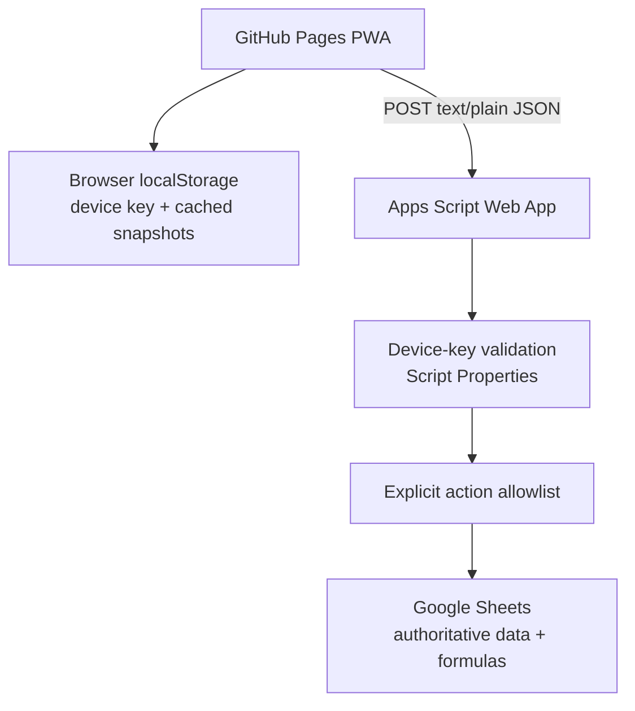

STATUS: CURRENT / AUTHORITATIVE
Last Updated: 2026-09-12

# Personal Finance PWA — Technical Handover

**Owner:** Glen Reyes  
**Source priority:** production GitHub `main` → current Apps Script deployment → live Google Sheet structure/formulas → production UI/screenshots → current docs → historical docs.

## Executive overview

Personal Finance is a private, single-owner, mobile-first PWA for expense capture, spending analysis, and Wealth decision support. The production stack remains:

```text
GitHub Pages PWA
→ authenticated POST
→ Google Apps Script Web App
→ Google Sheets
```

Google Sheets remains the authoritative database and calculation engine. The frontend never owns authoritative Wealth math.

The current production release adds a **PHILIPPINES** account group to Wealth with native CAD/PHP balance editing and Sheet-authoritative PHP→CAD conversion. Existing Canadian accounts, reserve management, National Bank USD handling, Expenses, Insights, authentication, service-worker architecture, and production Web App URL remain unchanged.

## Production identity

| Item | Current production value |
| --- | --- |
| Repository | `Geng-Geng8/personal-finance-assets` |
| Branch | `main` |
| Application release SHA | `ca8f973226b2c0fa301326789c865d848006aa1f` |
| Release | Philippines Wealth accounts with protected native-balance editing |
| Production Apps Script version | **37** |
| Previous backend rollback version | **36** |
| Previous frontend rollback SHA | `f6eeeac486a0e62340effbe7ce2b2b6340487485` |
| Production spreadsheet | `2026 Buckets Budget` |
| Production Sheet tab for Wealth | `2026-Budgets` |

The existing production Web App deployment was updated in place to Apps Script Version 37; its URL did not change.

## Current architecture



Normal runtime does **not** use Google OAuth. Financial reads and writes use authenticated `POST`. Financial GET APIs remain prohibited.

## API surface

| Action | Method | Current behavior |
| --- | --- | --- |
| `getExpenses` | Authenticated POST | Reads authoritative expenses, optionally bypassing short server cache |
| `addExpense` | Authenticated POST | Validates and appends one expense |
| `updateExpense` | Authenticated POST | Resolves immutable expense ID and updates the matching record |
| `deleteExpense` | Authenticated POST | Resolves immutable expense ID and deletes the matching record |
| `getWealth` | Authenticated POST | Returns summaries, Canadian accounts, Philippines accounts, and reserve state |
| `updateWealthAccountBalance` | Authenticated POST | Writes one allowlisted native balance, flushes Sheets, rereads full Wealth state |
| `updateWealthReserve` | Authenticated POST | Applies one allowlisted reserve operation and rereads full Wealth state |

For Wealth account writes the browser sends only:

```json
{
  "accountId": "logical_id",
  "balance": 123.45
}
```

The server rejects extra payload keys and never accepts client-supplied spreadsheet IDs, Sheet names, A1 ranges, rows, cells, formulas, FX rates, or currencies.

## Wealth architecture

### Summary area

`getWealth()` reads authoritative summary values from the `2026-Budgets` Sheet, including:

- Available Cash (`H14`)
- registered investment summaries (`I14:K14`)
- Crypto (`L14`)
- Total Invested (`M14`)
- protected reserves (`N14:P14`)
- Total Cash (`I29`)

Available Cash remains:

```text
Total Cash − Emergency Fund − Tax Reserve − Income Tax / CPP Reserve
```

`H14` is formula-driven and never directly writable.

### Existing Canadian accounts

The established Wealth account area remains `H17:J28`. The twelve previously approved account IDs remain supported, including:

- nine standard CAD accounts;
- National Bank FHSA (`I20`, guarded by `J14 = I20`);
- National Bank RRSP (`I22`, guarded by `K14 = I22`);
- National Bank TFSA-USD, which writes raw USD to `J21` while `I21` remains the protected CAD-conversion formula cell.

### Philippines-held accounts

The production backend reads `H30:J33` separately and returns a dedicated `philippinesAccounts` array. This avoids treating the `I29` Total Cash row as an account and preserves the existing `accounts` contract.

| Stable ID | Display name | Identity cell | Native write cell | Native currency | CAD output / guard |
| --- | --- | --- | --- | --- | --- |
| `ph_cash_cad` | Cash — CAD | H30 | I30 | CAD | none; already CAD |
| `ph_cash_php` | Cash — PHP | H31 | I31 | PHP | J31 formula |
| `gotyme_php` | GoTyme | H32 | I32 | PHP | J32 formula |
| `gcash_php` | GCash | H33 | I33 | PHP | J33 formula |

Exact PHP conversion formulas:

```text
J31 = I31 * GOOGLEFINANCE("CURRENCY:PHPCAD")
J32 = I32 * GOOGLEFINANCE("CURRENCY:PHPCAD")
J33 = I33 * GOOGLEFINANCE("CURRENCY:PHPCAD")
```

`J30` is intentionally blank because `I30` is already CAD.

Current Total Cash formula:

```text
=SUM(I23:I28)+I30+J31+I35+J32+J33
```

Current Available Cash formula:

```text
=I29-P14-N14-O14
```

The frontend shows PHP as the primary value and the Sheet-returned CAD equivalent as secondary text. It performs **no frontend FX calculation**.

### Philippines fail-closed behavior

Before a Philippines account can be editable, the backend verifies:

1. the trimmed live H-cell account name matches the server whitelist;
2. the native I-cell is not a formula;
3. for PHP accounts, the required J-cell PHPCAD formula matches the approved formula.

If identity mismatches, the account remains visible under its stable logical name but returns `balance: null`, is non-editable, and exposes no mismatched row value. The UI renders **Unavailable** rather than potentially mislabeling money.

If a PHP conversion formula is missing or changed, editing is disabled and the CAD equivalent is unavailable.

### Wealth write integrity

All Wealth writes:

- authenticate the device key;
- resolve a stable logical ID through the server whitelist;
- validate a finite non-negative balance with at most two decimals;
- reject arbitrary topology fields;
- verify account identity and required formulas;
- verify the native write cell is manual;
- use `LockService` and recheck inside the lock;
- write exactly one approved native input cell;
- call `SpreadsheetApp.flush()`;
- reread `getWealth()`;
- return the complete authoritative Wealth object.

The frontend does not apply optimistic Wealth balance mutations.

## Reserve management

Reserve management remains unchanged:

- Tax Reserve source: September 2026 input `N10`
- Income Tax / CPP Reserve source: September 2026 input `O10`
- Emergency Fund: `P14`
- Protected formulas: `N14`, `O14`, `H14`

Tax and Income Tax / CPP reserves support `add`, `pay`, and `replace`; Emergency Fund supports `replace` only. Current-month reserve targeting remains an optional future improvement, not an active release.

## PWA and cache behavior

- GitHub Pages serves the production frontend.
- Manifest uses standalone, portrait-first mobile behavior.
- Service worker caches static shell assets only; it does not cache financial API traffic.
- Expense and Wealth snapshots in `localStorage` are convenience copies, never authority.
- Removing the device clears authorization plus cached financial state.
- Installed-PWA cache/state issues can be resolved by reinstalling when the browser instance itself is stale; backend state should not be changed merely to work around a stale installed shell.

## Production validation record

Philippines Wealth release validation completed successfully:

- reviewed feature head: `1b35f324a0fabb6861696c6d349664015869f297`;
- production application commit: `ca8f973226b2c0fa301326789c865d848006aa1f`;
- Apps Script Version 37 deployed to the existing production Web App deployment;
- GitHub Pages deployed successfully;
- focused regression coverage passed;
- full regression suite passed **261 / 261**;
- production UI showed **16 accounts** with CASH, INVESTMENTS, and PHILIPPINES groups;
- one reversible live PHP-account validation passed using GCash;
- the native PHP source value changed through the PWA, the Sheet PHPCAD formula recalculated, Total Cash and Available Cash followed, and the exact original native value was restored;
- formula cells remained intact;
- no synthetic production value remains.

The temporary validation amount itself is intentionally not documented.

## Rollback strategy

Immediate rollback points for this release:

- backend: preserved Apps Script **Version 36**;
- frontend: previous production main SHA `f6eeeac486a0e62340effbe7ce2b2b6340487485` via a reviewed revert commit.

Do not force-reset shared `main`. Do not delete historical Apps Script versions. Keep the existing Web App deployment URL stable.

## Current status

**Production:** COMPLETE / LIVE.

The app currently covers:

- expense CRUD;
- spending search, filters, summaries, and charts;
- Wealth summaries;
- Canadian account editing;
- National Bank FHSA/RRSP/TFSA-USD handling;
- protected reserve management;
- Philippines-held CAD/PHP account editing with Sheet-driven FX conversion.

There is **no active engineering feature that must be started immediately**. Dynamic reserve month targeting remains backlog. The next intentional maintenance milestone is preparation of the 2027 Sheet before the 2027 budget year.

## Known constraints

1. Single-owner device-key security model is intentional.
2. Browser financial snapshots are sensitive and non-authoritative.
3. Apps Script/Sheets latency and quotas remain architectural constraints.
4. Reserve month targeting is still September-specific.
5. Spreadsheet and Apps Script time-zone settings should be reconciled before any new date-sensitive behavior.
6. Historical OAuth/config remnants are not the active runtime architecture.

## Authority rule

When this handover conflicts with an older document, inspect current GitHub `main`, the live Apps Script deployment, and the live Sheet formulas. Do not revive historical plans without reconciling them against production.