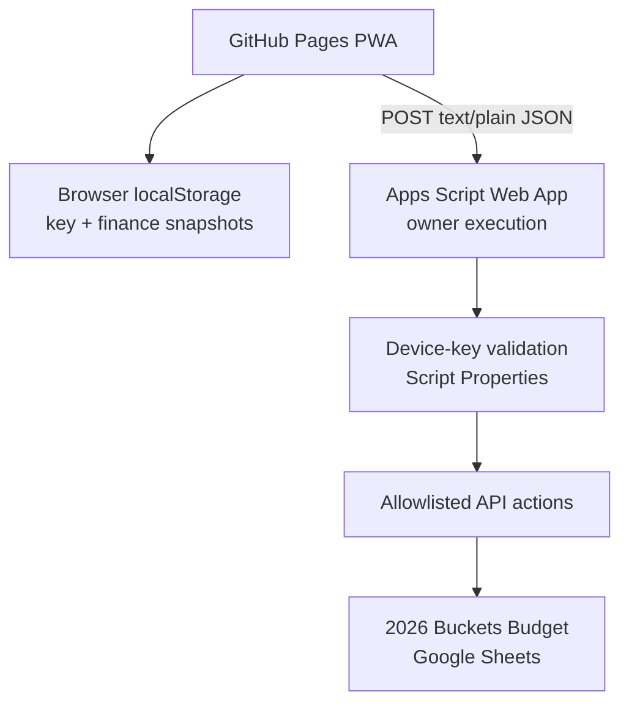

STATUS: CURRENT / AUTHORITATIVE
Last Updated: 2026-09-03

# Personal Finance PWA — Technical Handover

**Owner:** Glen Reyes  
**Source of Truth:** Current GitHub `main`, current production Apps Script deployment, current `2026 Buckets Budget` Sheet structure, then current production UI.  
**Supersedes:** Earlier Personal Finance architecture and authentication handovers, including the Google Drive document titled `Personal Finance application architecture` and repository Stage 2/3 planning documents where they conflict with production.

## Executive overview

Personal Finance is a private, single-owner, mobile-first Progressive Web App for recording expenses, reviewing spending patterns, and making wealth decisions. The installed frontend is served by GitHub Pages. It sends authenticated JSON envelopes by `POST` to a Google Apps Script Web App. Apps Script validates an owner-only device key held in browser `localStorage`, then reads or writes the production Google Sheet. Google Sheets remains both the database and calculation engine.

The current production release is Phase 2A: Wealth account editing is live in production for nine approved manual accounts. The active next phase is Phase 2B: reserve editing source audit.

## Production identity

| Item | Current production value |
| --- | --- |
| Repository | [Geng-Geng8/personal-finance-assets](https://github.com/Geng-Geng8/personal-finance-assets) |
| Production PWA | [GitHub Pages production](https://geng-geng8.github.io/personal-finance-assets/) |
| Branch | `main` |
| Current main SHA | `ba6a252e96d4aa779c381c082f211e1851c45d6f` |
| Phase 2A branch | `stage-7-wealth-account-editing` merged into `main` |
| Pre-Phase-2A rollback branch | `pre-phase-2a-wealth-edit-production` |
| Pre-Phase-2A production SHA | `9cb076cc2bcf62f7b5c29d225bb9da1638939b30` |
| Historical Stage 6 rollback branch | `pre-stage-6-wealth-production` (`6c57290f3496cc44d06febc3284ee94e3259958f`) |
| Production Apps Script project | Script ID `1RHBFF7H5Vqnlh97Gt4KuIt_NdBRYgfGCCDTK2zmkMBNbgUtLybxwR4CF` |
| Production Apps Script version | Version 30 — `Phase 2A Wealth Account Editing Production Candidate` |
| Production Web App deployment | `AKfycbxoRJ6dv8RdrZNtR_IjGkgCc_J6sbLyffsxt9xEiYJLjDGeWsJ0o73HYLcjTnJX3ajQ` |
| Preserved Apps Script versions | 20, 22, 23, 28 (prior Stage 6 rollback), 30 |
| Production spreadsheet | `2026 Buckets Budget` |

The Apps Script version label and historical version list are owner-confirmed production state; Git alone cannot prove deployment version numbers. The Web App deployment ID is also present in current `config.js`.

## Current architecture



Request envelope:

```json
{
  "deviceKey": "[secret runtime value — never document]",
  "action": "getExpenses",
  "payload": {}
}
```

The transport uses `Content-Type: text/plain;charset=utf-8`. The device key is never placed in a URL, query parameter, custom header, source file, service worker, prompt, screenshot, documentation, or test fixture.

The Apps Script manifest sets the Web App to execute as the deploying user and allows anonymous access at the Google transport edge. Application access is still private because every financial `POST` is rejected unless `doPost` validates the device key against the `PERSONAL_APP_DEVICE_KEY` Script Property.

Normal runtime does **not** use Google OAuth. Current `config.js` still contains legacy OAuth/API-executable fields from the earlier migration path, but current `api.js` does not consume them. They are historical configuration residue, not the production authentication architecture.

## API surface

| Action | Method | Current behavior | Authoritative data source |
| --- | --- | --- | --- |
| `getExpenses` | Authenticated POST | Returns transactions; optional server-cache bypass through payload | `Spending_Master2026` |
| `addExpense` | Authenticated POST | Validates and appends one transaction | `Spending_Master2026` |
| `updateExpense` | Authenticated POST | Resolves immutable ID, then updates columns B:H | `Spending_Master2026` |
| `deleteExpense` | Authenticated POST | Resolves immutable ID, then deletes its row | `Spending_Master2026` |
| `getWealth` | Authenticated POST | Returns summary metrics and account rows | `2026-Budgets` |
| `updateWealthAccountBalance` | Authenticated POST | Validates accountId and balance (max 2 decimals), verifies expected name and non-formula status with LockService, writes approved cell, and returns fresh full Wealth object | `2026-Budgets` |

`doGet` denies requests containing `action` or `function`. A bare Apps Script Web App GET may render the retained Apps Script HTML shell, but it must never return financial data. The installed GitHub Pages PWA is the normal client.

## Repository responsibilities

| Path | Responsibility | Production status |
| --- | --- | --- |
| `/index.html` | Static app shell, auth gate, Expenses, Insights, Wealth markup, dialogs, PWA registration | GitHub Pages runtime |
| `/styles.css` | Complete responsive visual system | GitHub Pages runtime |
| `/app.js` | UI state, expense workflows, insights, caches, Wealth rendering, PWA install behavior | GitHub Pages runtime |
| `/api.js` | Device-key storage/validation and allowlisted POST transport | GitHub Pages runtime |
| `/config.js` | Production Web App endpoint plus unused legacy OAuth-era identifiers | GitHub Pages runtime |
| `/sw.js` | Static shell service worker; never handles financial API traffic | GitHub Pages runtime |
| `/manifest.webmanifest` | Standalone PWA identity, icons, colors, start URL | GitHub Pages runtime |
| `/frontend/` | Exact mirror of the seven root frontend files at current `main` | Retained mirror; root is the Pages surface |
| `/apps-script/Code.js` | Production backend, validation, Sheet access, expense mutations, Wealth read API | Apps Script source |
| `/apps-script/appsscript.json` | V8, Sheets scope, owner execution/API settings, Web App access settings | Apps Script manifest source |
| `/apps-script/Index.html`, `JavaScript.html`, `Styles.html` | Retained Apps Script-hosted UI | Not normal PWA runtime |
| `/tests/` | Node test suites for finance logic, security, auth history, caching/PWA behavior, production safety, Stage 6 Wealth | QA source |
| `/poc/`, `/test-apps-script/` | Historical isolated OAuth proof-of-concept and test backend | Not production runtime |
| `/docs/` | Historical design, cutover, and test records | Context only; not current authority |

At `main`, root and `/frontend/` copies of `api.js`, `app.js`, `config.js`, `index.html`, `styles.css`, `sw.js`, and `manifest.webmanifest` are byte-identical. Future changes must either preserve that intentional mirror or explicitly retire it in a separate approved maintenance phase.

## Expenses architecture

Transactions live in `Spending_Master2026`, row 2 onward, columns A:H: immutable ID, date, cost, bucket, category, item, notes, and payment method.

- The server reads A:H in one batch and returns normalized objects.
- Expense dates are exchanged as `YYYY-MM-DD`.
- Costs must be finite, positive, and normalized through integer cents.
- Bucket/category combinations and payment methods are validated against backend allowlists.
- Add, update, and delete use `LockService.getScriptLock()`.
- Updates and deletes resolve the live row by immutable transaction ID, never a client-supplied row number.
- The Apps Script expense read cache uses `CacheService` for 30 seconds and is invalidated after mutations.
- The browser renders cached transactions quickly, then reconciles with Google Sheets.
- Expense mutations currently use guarded optimistic UI behavior. This pattern must not be copied to Wealth writes.
- Search, filtering, sorting, summaries, and charts are client-derived views and do not mutate the Sheet.

## Wealth architecture

Wealth supports authenticated read and approved single-account editing. `getWealth()` reads:

- `H14:P14` for Available Cash, registered investment totals, Crypto, Total Invested, and protected reserves.
- `I29` for Total Cash.
- `H17:I28` for individual account names, balances, formula status, and editability metadata.

The returned object contains `availableCash`, `tfsa`, `fhsa`, `rrsp`, `crypto`, `totalInvested`, `taxReserve`, `incomeTaxCppReserve`, `emergencyFund`, `totalCash`, `accounts`, and `updatedAt`.

Phase 2A established an authoritative server-owned whitelist of exactly **nine approved manual accounts**:
- `eq_tfsa` (H17 / I17, `EQ-TFSA`)
- `wealthsimple_tfsa` (H18 / I18, `WEALTHSIMPLE- TFSA`)
- `national_bank_tfsa` (H19 / I19, `National Bank TFSA`)
- `simplii_chequing` (H23 / I23, `Simplii - Che`)
- `simplii_savings` (H24 / I24, `Simplii - Sav`)
- `eq_savings` (H25 / I25, `EQ - Sav`)
- `eq_bank_card` (H26 / I26, `EQ Bank Card`)
- `eq_geng_cash` (H27 / I27, `EQ - Geng-Cash`)
- `td_savings` (H28 / I28, `TD - Sav`)

Non-editable accounts remain strictly read-only:
- `national_bank_fhsa` (I20) — manual input, but read-only because J14 is not formula-linked.
- `national_bank_tfsa_usd` (I21) — formula-driven currency conversion; writes permanently prohibited.
- `national_bank_rrsp` (I22) — manual input, but read-only because K14 is not formula-linked.

Writes use `updateWealthAccountBalance` with payload `{ accountId, balance }`. The server validates authorization, allowlists the ID, enforces maximum 2 decimal places (between 0.00 and 1,000,000,000.00), verifies the live target cell is not a formula, matches the expected account name in column H, and executes within `LockService.getScriptLock(10000)`. After the single-cell write, Apps Script rereads `getWealth()` and returns the full fresh object. The frontend updates local state and cache only on confirmed success.

See `03_Google_Sheet_Data_Model.md` for the complete cell mapping and formula relationships.

## PWA and cache behavior

- Manifest display mode is `standalone`; orientation is portrait-primary.
- Service-worker cache name is `finance-shell-v2`.
- Static images use cache-first behavior.
- Same-origin HTML/scripts use network-first behavior with cached fallback.
- Cross-origin requests and non-GET requests are not intercepted.
- URLs resembling API calls are excluded from service-worker caching.
- Expense and Wealth snapshots are stored separately in `localStorage`; they are convenience copies, not authority.
- The device key is stored separately in `localStorage` and must never be included inside a snapshot.
- Removing the device clears the key, expense snapshot/timestamp, Wealth snapshot/timestamp, and in-memory financial state. Static shell cache may remain.
- An unauthorized response clears the invalid key locally.

## Rollback strategy

The primary Phase 2A rollback targets:

- Git branch `pre-phase-2a-wealth-edit-production` at `9cb076cc2bcf62f7b5c29d225bb9da1638939b30`.
- Apps Script deployment rollback: edit the existing Web App deployment `AKfycbxoRJ6dv8RdrZNtR_IjGkgCc_J6sbLyffsxt9xEiYJLjDGeWsJ0o73HYLcjTnJX3ajQ` to point to preserved **Version 28** (`Stage 6 Wealth Read-Only Production`).

Historical checkpoints preserved for depth:
- `pre-stage-6-wealth-production` at `6c57290f3496cc44d06febc3284ee94e3259958f` with Version 23.
- Historical immutable Apps Script versions: 20, 22, 23, 28, 30.

Do not force-reset shared history. Prefer a reviewed revert commit for GitHub Pages and edit the **existing** Apps Script Web App deployment to a preserved immutable version.

## Test baseline and current verification

- Phase 2A release record: **141 / 141 automated tests passed** (including 39 dedicated Stage 7 balance-editing tests).
- Stage 6 release record: **102 / 102 automated tests passed** (historical baseline).
- Non-production integration gate passed: verified against dedicated Apps Script test deployment and synthetic spreadsheet (all 9 accounts tested, formula overwrite protection verified, LockService serialization verified, and test project purged).
- Reversible production write passed: tested against production TD Savings, original value restored exactly, and authoritative totals confirmed returned to baseline.

## Current status and immediate next phase

**Production:** Phase 2A Wealth Account Editing is live (Apps Script Version 30, `main` at `ba6a252e96d4aa779c381c082f211e1851c45d6f`).  
**Active Next Phase:** Phase 2B — reserve editing source audit (N2:N13, O2:O13, P14, labels, monthly semantics, and dependent formulas). Do not mutate production reserve cells without audit approval.

## Known constraints and discrepancies

1. The app is single-owner; the shared device key is intentional and has no multi-user permission model.
2. Browser `localStorage` contains sensitive cached finance data. Device removal and unauthorized handling must keep clearing it.
3. Apps Script quotas, execution time, cache size, and Google Sheets latency constrain the architecture.
4. The production Sheet reports time zone `America/New_York`; the Apps Script manifest reports `America/Toronto`. Current date formatting reads the Sheet time zone. Do not silently change either; audit the mismatch before time-sensitive changes.
5. `config.js` contains unused OAuth-era values. They must not be described as active authentication.
6. Older Drive architecture guidance proposed unauthenticated GET for expenses. That guidance is superseded and prohibited.
7. Current Wealth account categorization is heuristic. Phase 2A requires explicit IDs and editability metadata.
8. The clean-clone full test suite has one environment-dependent Stage 2 failure described above.

## Authority rule

When this handover and an older document disagree, inspect current GitHub `main` and current production resources. Never copy an older implementation plan into production without reconciling it against the current SHA and `04_Security_and_Architecture_Rules.md`.
