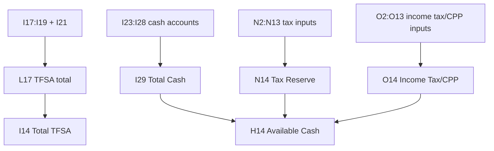

STATUS: CURRENT / AUTHORITATIVE
Last Updated: 2026-09-03

# Personal Finance PWA — Google Sheet Data Model

**Owner:** Glen Reyes  
**Source of Truth:** Read-only inspection of the production spreadsheet `2026 Buckets Budget` on 2026-09-03, reconciled with Apps Script at Phase 2B application release SHA `4679eb5f837ed0eda4777716bf99a385967cc138` (Apps Script Version 31).
**Related master:** `01_Personal_Finance_App_Technical_Handover_CURRENT.md`

This document describes structure and formula relationships. It intentionally excludes live balances, transaction rows, and the private spreadsheet ID.

## Runtime tabs

| Tab | Runtime purpose | Current code access |
| --- | --- | --- |
| `Spending_Master2026` | Transaction database for Expenses and Spending Insights | Read and write |
| `2026-Budgets` | Wealth account inputs, summary values, reserves, and Sheet formulas | Read-only in Stage 6 |

The workbook contains additional historical, monthly, mapping, and net-worth tabs. Current production Apps Script does not directly access them for the PWA. Do not create a separate Wealth database unless a future, evidence-backed requirement justifies it.

## `Spending_Master2026`

Header row is row 1; transactions begin at row 2.

| Column | Header in Sheet | API field | Role | Write rule |
| --- | --- | --- | --- | --- |
| A | `ID` | `id` | Immutable logical record ID | Server-generated; never client row number |
| B | `Date` | `date` | Transaction date | Valid real date, exchanged as `YYYY-MM-DD` |
| C | `Cost` | `cost` | Expense amount | Finite, positive, normalized through integer cents |
| D | `Buckets` | `bucket` | Top-level spending bucket | Backend allowlist |
| E | `Category ` | `category` | Category belonging to bucket | Backend bucket/category validation |
| F | `Item` | `item` | Required description | Trimmed, non-empty |
| G | `Notes` | `notes` | Optional detail | Trimmed string |
| H | `Payment Method` | `paymentMethod` | Payment type | Backend allowlist |

The backend reads A:H in one batch. Add appends one row. Update preserves A and writes B:H. Delete resolves the row from immutable ID at mutation time. All mutations use `LockService`, then invalidate the short-lived server expense cache.

## `2026-Budgets` Wealth summary

Classification terms:

- **MANUAL INPUT:** a user-entered numeric cell, not a formula.
- **FORMULA:** a Sheet-computed cell.
- **SUMMARY:** a top-level value consumed by the Wealth UI.
- **EDITABLE:** approved target for the current write phase.
- **READ ONLY:** never writable through the current phase.

| Cell | Wealth meaning | Sheet entry type at inspection | Role | App editability |
| --- | --- | --- | --- | --- |
| H14 | Available Cash | FORMULA: `I29 − P14 − N14 − O14` | SUMMARY | READ ONLY |
| I14 | Total TFSA | FORMULA referencing L17 | SUMMARY | READ ONLY |
| J14 | Total FHSA | MANUAL INPUT | SUMMARY | READ ONLY; dependency decision required |
| K14 | Total RRSP | MANUAL INPUT | SUMMARY | READ ONLY; dependency decision required |
| L14 | Total Crypto | MANUAL INPUT | SUMMARY | READ ONLY in Phase 2A/2B |
| M14 | Total Invested | FORMULA: sum of I14:K14 | SUMMARY | READ ONLY |
| N14 | Tax Reserve | FORMULA: `sum of N2:N13` | SUMMARY | READ ONLY (formula-protected; fed by N2:N13, active September 2026 input cell is N10) |
| O14 | Income Tax / CPP Reserve | FORMULA: `sum of O2:O13` | SUMMARY | READ ONLY (formula-protected; fed by O2:O13, active September 2026 input cell is O10) |
| P14 | Emergency Fund | MANUAL INPUT | SUMMARY / RESERVE | EDITABLE (replace only via `emergency_fund`) |
| I29 | Total Cash | FORMULA: sum of I23:I28 | SUMMARY | READ ONLY |

`M14` excludes Crypto by design because it sums registered investment totals I14:K14. Crypto is read separately from L14 and displayed separately in the UI.

## Individual account table: H17:I28

The exact Sheet labels differ slightly from the normalized product names. The stable IDs below are the authoritative **Phase 2A production contract**, implemented in production with explicit stable logical IDs, live formula inspection, and editability metadata.

| Cell | Exact Sheet label | Product display name | Stable logical ID | Cell type | Initial Phase 2A status |
| --- | --- | --- | --- | --- | --- |
| I17 | `EQ-TFSA` | EQ-TFSA | `eq_tfsa` | MANUAL INPUT | EDITABLE |
| I18 | `WEALTHSIMPLE- TFSA` | WEALTHSIMPLE-TFSA | `wealthsimple_tfsa` | MANUAL INPUT | EDITABLE |
| I19 | `National Bank TFSA` | National Bank TFSA | `national_bank_tfsa` | MANUAL INPUT | EDITABLE |
| I20 | `National Bank FHSA ` | National Bank FHSA | `national_bank_fhsa` | MANUAL INPUT | READ ONLY initially: J14 is not formula-linked |
| I21 | `National Bank TFSA-USD` | National Bank TFSA-USD | `national_bank_tfsa_usd` | FORMULA: currency conversion with embedded constants | READ ONLY |
| I22 | `National Bank RRSP` | National Bank RRSP | `national_bank_rrsp` | MANUAL INPUT | READ ONLY initially: K14 is not formula-linked |
| I23 | `Simplii - Che` | Simplii Chequing | `simplii_chequing` | MANUAL INPUT | EDITABLE |
| I24 | `Simplii - Sav` | Simplii Savings | `simplii_savings` | MANUAL INPUT | EDITABLE |
| I25 | `EQ - Sav` | EQ Savings | `eq_savings` | MANUAL INPUT | EDITABLE |
| I26 | `EQ Bank Card` | EQ Bank Card | `eq_bank_card` | MANUAL INPUT | EDITABLE |
| I27 | `EQ - Geng-Cash` | EQ Geng-Cash | `eq_geng_cash` | MANUAL INPUT | EDITABLE |
| I28 | `TD - Sav` | TD Savings | `td_savings` | MANUAL INPUT | EDITABLE |

Initial whitelist size: **nine editable accounts**. I20 and I22 are manual but not initially approved because writing them would not automatically refresh J14/K14 in the inspected Sheet. I21 is formula-driven and must never be written by the app.

## Verified formula dependencies



P14 Emergency Fund also feeds H14 directly. `M14` is calculated from I14:K14.

## Known dependency gaps

- J14 is currently a user-entered numeric summary; it is not formula-linked to I20.
- K14 is currently a user-entered numeric summary; it is not formula-linked to I22.
- L14 Crypto is a user-entered summary outside the H17:I28 account table.
- P14 Emergency Fund is an editable manual input cell in Phase 2B (direct balance replacement only).

Do not paper over these gaps by calculating totals in frontend JavaScript. Either deliberately establish/approve Sheet formulas or keep the affected account inputs read-only.

## Phase 2A server mapping

The browser sends only:

```json
{
  "accountId": "eq_tfsa",
  "balance": 0
}
```

The server owns the map from `accountId` to the exact approved cell. It must never accept a Sheet name, spreadsheet ID, A1 range, row number, or cell address from the browser.

Before every write, the server must:

1. Authenticate the POST device key.
2. Reject unknown or non-editable account IDs.
3. Resolve the exact source cell from the server-side whitelist.
4. Inspect that live cell and reject the write if it contains a formula.
5. Validate the numeric balance using an explicitly documented balance policy.
6. Acquire `LockService`.
7. Recheck the target formula state after acquiring the lock.
8. Write one approved cell.
9. Let the Sheet recalculate.
10. Call `getWealth()` and return the complete fresh Wealth object.

The client must replace its Wealth state and cache only with that returned object. No aggressive optimistic update.

## Phase 2B reserve management mapping

The browser sends:

```json
{
  "reserveId": "tax_reserve_2026_09",
  "operation": "add",
  "amount": 150.00
}
```

Authoritative server-side reserve targets:

| Stable logical ID | Exact Sheet cell | Reserve type | Approved operations | Write rule |
| --- | --- | --- | --- | --- |
| `tax_reserve_2026_09` | N10 | Tax Reserve (September 2026) | `add`, `pay`, `replace` | Manual input; cannot make total negative |
| `income_tax_cpp_reserve_2026_09` | O10 | Income Tax / CPP (September 2026) | `add`, `pay`, `replace` | Manual input; cannot make total negative |
| `emergency_fund` | P14 | Emergency Fund | `replace` only | Manual input; cannot be negative |

Strictly protected formula/read-only cells:
- `N14`: `=SUM(N2:N13)` (Tax Reserve summary; never writable)
- `O14`: `=SUM(O2:O13)` (Income Tax / CPP summary; never writable)
- `H14`: `=I29-P14-N14-O14` (Available Cash summary; never writable)

Before every reserve write, the server must:

1. Authenticate the POST device key.
2. Reject unknown or non-editable reserve IDs.
3. Verify the operation is permitted for the target reserve (`replace` only for `emergency_fund`; `add`/`pay`/`replace` for tax reserves).
4. Validate numeric input (finite, positive for add/pay, maximum two decimal places).
5. Resolve the target cell from the server-side whitelist (`N10`, `O10`, `P14`).
6. Inspect the live target cell and reject if it contains a formula.
7. Inspect dependent formula cells (`N14`, `O14`, `H14`) and reject if any formula is altered or missing.
8. Enforce the non-negative policy: the operation must not cause the projected authoritative reserve total to drop below zero.
9. Acquire `LockService.getScriptLock(10000)`.
10. Recheck the target formula state inside the lock.
11. Write the single approved cell.
12. Flush and let the Sheet recalculate.
13. Call `getWealth()` and return the complete authoritative fresh Wealth object.

Known intentional limitation: Reserve source editing is hard-coded to September 2026 (`N10` / `O10`) in this release. Current-month rollover and dynamic month targeting are deferred to the next phase.

## Time-zone note

The production spreadsheet reports `America/New_York`; `apps-script/appsscript.json` reports `America/Toronto`. The current backend formats expense dates using the spreadsheet time zone. This discrepancy is documented, not resolved. Audit both settings before any date/time behavior change.
