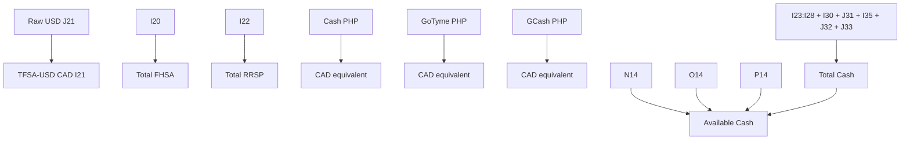

STATUS: CURRENT / AUTHORITATIVE
Last Updated: 2026-09-12

# Personal Finance PWA — Google Sheet Data Model

**Owner:** Glen Reyes  
**Source of Truth:** Current production spreadsheet `2026 Buckets Budget`, reconciled with production Apps Script Version 37 and application release SHA `ca8f973226b2c0fa301326789c865d848006aa1f`.  
**Related master:** `01_Personal_Finance_App_Technical_Handover_CURRENT.md`

This document describes structure, formulas, editability, and server mappings. It intentionally excludes live balances and transaction contents.

## Runtime tabs

| Tab | Runtime purpose | Access |
| --- | --- | --- |
| `Spending_Master2026` | Expense transaction database | Read/write |
| `2026-Budgets` | Wealth inputs, summaries, reserves, and formulas | Read plus strictly allowlisted writes |

## `Spending_Master2026`

Header row is row 1; transactions begin at row 2.

| Column | Meaning | Write rule |
| --- | --- | --- |
| A | Immutable expense ID | Server-generated; never client row number |
| B | Date | Valid date, exchanged as `YYYY-MM-DD` |
| C | Cost | Finite positive money value |
| D | Bucket | Backend allowlist |
| E | Category | Must belong to selected bucket |
| F | Item | Required trimmed text |
| G | Notes | Optional trimmed text |
| H | Payment Method | Backend allowlist |

Updates/deletes resolve the current row from the immutable ID. Expense mutations use `LockService` and invalidate the short-lived server cache.

## `2026-Budgets` Wealth summary

| Cell | Meaning | Type | App rule |
| --- | --- | --- | --- |
| H14 | Available Cash | FORMULA `=I29-P14-N14-O14` | READ ONLY |
| I14 | Total TFSA | FORMULA | READ ONLY |
| J14 | Total FHSA | FORMULA `=I20` | READ ONLY; guard for I20 writes |
| K14 | Total RRSP | FORMULA `=I22` | READ ONLY; guard for I22 writes |
| L14 | Total Crypto | MANUAL INPUT | displayed separately |
| M14 | Total Invested | FORMULA over registered totals | READ ONLY |
| N14 | Tax Reserve | FORMULA `=SUM(N2:N13)` | READ ONLY |
| O14 | Income Tax / CPP Reserve | FORMULA `=SUM(O2:O13)` | READ ONLY |
| P14 | Emergency Fund | MANUAL INPUT | editable only through reserve API |
| I29 | Total Cash | FORMULA | READ ONLY |

Current Total Cash formula:

```text
=SUM(I23:I28)+I30+J31+I35+J32+J33
```

This formula deliberately includes CAD-native cash directly and PHP accounts through their CAD-equivalent J cells.

## Existing account area: H17:J28

The production model retains the twelve established account IDs.

| Stable ID | Source / write behavior | Currency | Protection |
| --- | --- | --- | --- |
| `eq_tfsa` | I17 | CAD | manual input |
| `wealthsimple_tfsa` | I18 | CAD | manual input |
| `national_bank_tfsa` | I19 | CAD | manual input |
| `national_bank_fhsa` | I20 | CAD | J14 must remain `=I20` |
| `national_bank_tfsa_usd` | writes J21; displays I21 | USD input / CAD display | I21 must remain `=J21*GOOGLEFINANCE("CURRENCY:USDCAD")` |
| `national_bank_rrsp` | I22 | CAD | K14 must remain `=I22` |
| `simplii_chequing` | I23 | CAD | manual input |
| `simplii_savings` | I24 | CAD | manual input |
| `eq_savings` | I25 | CAD | manual input |
| `eq_bank_card` | I26 | CAD | manual input |
| `eq_geng_cash` | I27 | CAD | manual input |
| `td_savings` | I28 | CAD | manual input |

I21 is never directly writable.

## Philippines-held account area: H30:J33

The production backend reads this area separately from H17:J28 and returns a dedicated `philippinesAccounts` array.

| Row | Exact trimmed Sheet label | Stable ID | Native input | Currency | CAD equivalent / guard |
| --- | --- | --- | --- | --- | --- |
| 30 | `cash (Cad)` | `ph_cash_cad` | I30 | CAD | J30 intentionally blank |
| 31 | `Cash (php)` | `ph_cash_php` | I31 | PHP | J31 formula |
| 32 | `GoTyme (Php)` | `gotyme_php` | I32 | PHP | J32 formula |
| 33 | `Gcash(Php)` | `gcash_php` | I33 | PHP | J33 formula |

The live H30:H33 labels contain trailing whitespace in some cells; the server trims the live label before identity comparison.

Exact PHP conversion formulas:

```text
J31 = I31 * GOOGLEFINANCE("CURRENCY:PHPCAD")
J32 = I32 * GOOGLEFINANCE("CURRENCY:PHPCAD")
J33 = I33 * GOOGLEFINANCE("CURRENCY:PHPCAD")
```

Column I is the only writable native-balance source for these accounts. J31:J33 are formula outputs and must never be directly writable.

## Philippines read contract

Each returned Philippines account contains the logical data the frontend needs, including:

- stable `id`;
- normalized display `name`;
- native `balance`;
- `currency` / `editCurrency`;
- `isEditable`;
- formula status;
- `cadEquivalent` for PHP accounts only.

The browser is not told Sheet names, rows, A1 cells, formulas, or FX rates.

### Fail-closed identity rule

If a live H30:H33 identity does not match the server whitelist:

- `balance` is returned as `null`;
- the account is non-editable;
- PHP `cadEquivalent` is `null`;
- no value from the mismatched row is exposed under the stable account name.

This prevents a future row swap from displaying the wrong money under the wrong label.

### Fail-closed formula rule

For PHP accounts, if the J-cell PHPCAD formula is missing or changed:

- the account is non-editable;
- the CAD equivalent is unavailable;
- writes are rejected.

## Wealth write mapping

The browser sends only:

```json
{
  "accountId": "gotyme_php",
  "balance": 100.00
}
```

The server owns the exact mapping. Any extra payload keys are rejected.

Before every account write the server must:

1. authenticate the POST device key;
2. reject unknown IDs;
3. resolve the exact target through the server whitelist;
4. verify the live identity label;
5. verify any required formula guard;
6. verify the native write cell contains no formula;
7. validate a finite non-negative balance with at most two decimals;
8. acquire `LockService`;
9. repeat critical identity/formula checks inside the lock;
10. write one approved native input cell;
11. flush Sheet recalculation;
12. call `getWealth()` and return the complete authoritative object.

## Reserve management mapping

Current reserve write targets remain:

| Stable ID | Cell | Operations |
| --- | --- | --- |
| `tax_reserve_2026_09` | N10 | `add`, `pay`, `replace` |
| `income_tax_cpp_reserve_2026_09` | O10 | `add`, `pay`, `replace` |
| `emergency_fund` | P14 | `replace` only |

Protected formulas remain N14, O14, and H14. Reserve month targeting is still September-specific.

## Verified Wealth dependency graph



All currency conversions shown above are Sheet calculations, not frontend calculations.

## Production validation status

The Philippines area is production-proven. A reversible GCash write was performed through the PWA, the Sheet conversion and dependent totals recalculated, and the exact original native value was restored. No synthetic value remains.

## Time-zone note

The production spreadsheet reports `America/New_York`; Apps Script historically reports `America/Toronto`. Current expense date formatting reads the spreadsheet time zone. Audit this discrepancy before introducing new date-sensitive behavior.